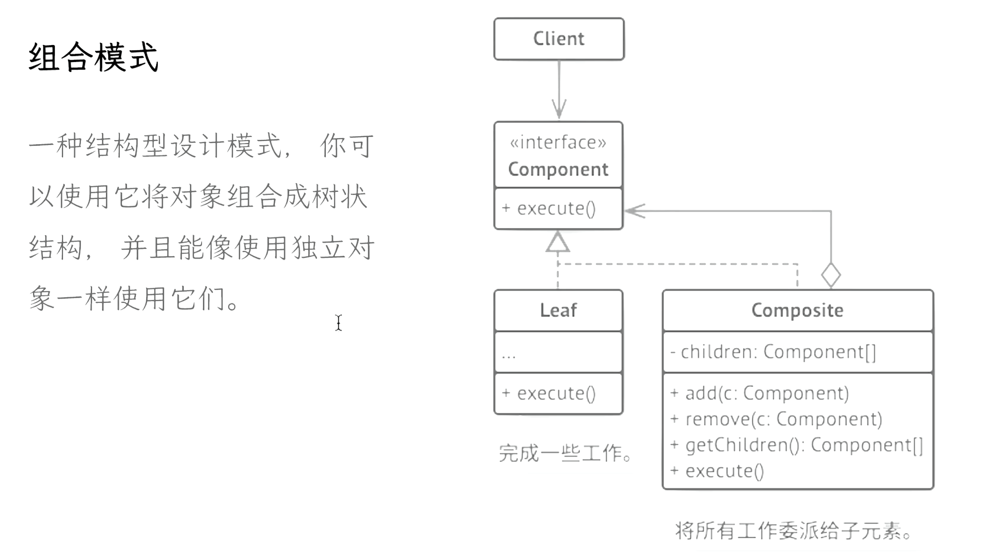
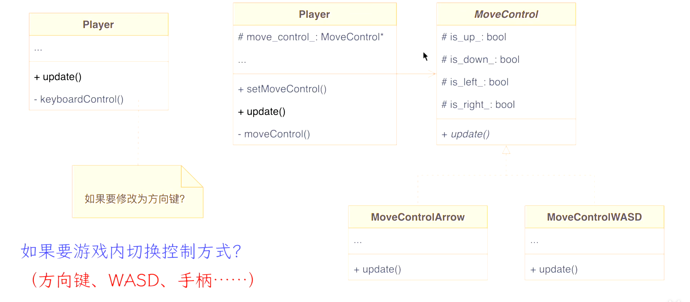

# 组合模式

## 介绍

{: width="70%" height="auto"}

最简单的例子就是角色控制器，原先的角色控制可能是硬编码决定的，但是如果从键盘换成了手柄，硬编码带来的复杂度会非常大
可以在角色身上添加一个控制器，角色关联到控制器，然后doSomething
这里需要处理两件事
1. 每个子类Leaf根据自身特点实现了doSomething
2. 角色需要增加切换控制器的逻辑

{: width="70%" height="auto"}

