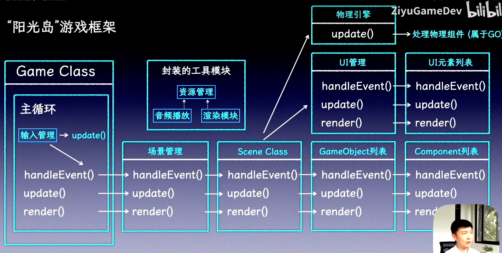

# SunnyLand

## 12/24日

### Record

1. **编译**
踩坑SDL_Mixer编译环节，不清楚cmakeList是如何运作的
对于大型文件的编译不了解

下载文件包进行编译，但是安装不是标准路径

2. **Spdlog**

C++游戏开发日志库标配

## 12/25

clangd + llvm 语言服务器
1. 需要安装clangd和llvm
2. 需要配置setting.json，配置clangd开启和参数
3. 需要配置compile_commands.json记录每个源文件如何被编译，clangd通过该文件获取准确的编译命令

## 12/28

### 游戏架构设计

**组件模式**

组件通常在定义游戏实体的核心部分中使用，但它们在其他地方也有用。 这个模式应用在在如下情况中：
1. 有一个涉及了多个领域的类，而你想保持这些领域互相隔离。
2. 一个类正在变大而且越来越难以使用。
3. 想要能定义一系列分享不同能力的类，但是使用继承无法让你精确选取要重用的部分

**游戏分层架构**

1. 工具层
2. 游戏逻辑层
3. 引擎核心层
4. 平台抽象层

### Rule of Five

在 C++ 中，Rule of Five 指的是如果一个类管理资源（比如裸指针、文件句柄等），你应该考虑显式声明/定义这五个特殊成员函数 — 因为定义其中一个通常改变编译器对其它默认函数的生成规则

~T() — 析构函数
T(const T&) — 拷贝构造函数
T& operator=(const T&) — 拷贝赋值运算符
T(T&&) noexcept — 移动构造函数
T& operator=(T&&) noexcept — 移动赋值运算符

如果类直接管理资源（非 RAII 类型），实现一个通常需要实现全部五个以确保拷贝/移动/销毁语义正确，避免双重释放或资源泄漏。
现代 C++ 推荐使用 Rule of Zero：用智能指针（std::unique_ptr/std::shared_ptr）或容器来管理资源，这样通常不需要自己实现这五个函数。

